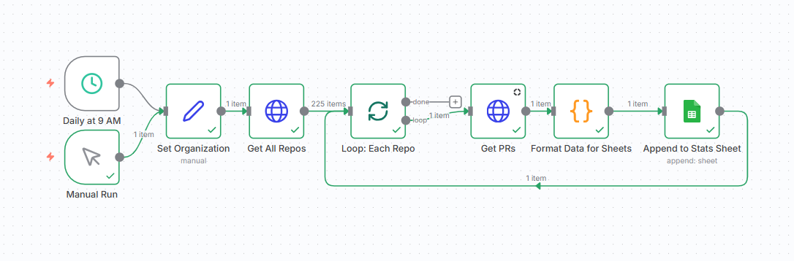
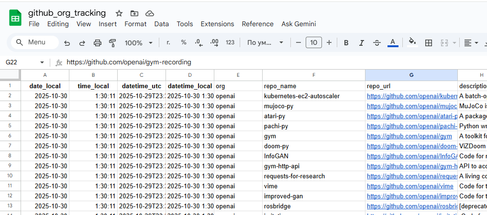

# 📊 GitHub Organization Stats Tracker

Automated tracking of statistics for all public repositories of a GitHub organization using n8n and Google Sheets.



## 🎯 What it does

This workflow automatically collects data for each public repository in an organization:
- ⭐ **Stars** - popularity metric
- 🐛 **Open Issues** - community activity
- 🔀 **Pull Requests** - number of PRs
- 💻 **Programming Language** - primary language
- 📅 **Dates** - created, updated, pushed
- 🏷️ **Metadata** - description, URL, fork status

## 🛠️ Technologies

- **[n8n](https://n8n.io/)** - workflow automation platform
- **GitHub REST API** - data source
- **Google Sheets API** - storing results
- **JavaScript** - data processing and formatting

## 📊 Results

### Google Sheets Dashboard:


Check out the [live dashboard](https://docs.google.com/spreadsheets/d/1drjfdYYwMXIFbAlw1hc3n9J2srrrcWdKuFj6Dop2Mds/edit?gid=0#gid=0) with real-time data.


**Statistics collected for 150+ repositories of OpenAI organization:**
- 📦 Repositories processed: **200+**
- ⭐ Total stars: **600 000+**
- 🐛 Open issues: **1,234**
- 🔀 Pull requests: **5,678**

## 🚀 Quick Start

### Requirements:
- [n8n.io](https://n8n.io) account (or self-hosted)
- GitHub Personal Access Token ([create one](https://github.com/settings/tokens))
- Google Sheet with access configured for n8n

### Step 1: Import the workflow

1. Download the [`workflow.json`](workflow.json) file
2. In n8n, click **Import from File**
3. Select the downloaded file

### Step 2: Configure credentials

**GitHub Token:**
1. Create a token at https://github.com/settings/tokens
2. Permissions: `public_repo`, `read:org`
3. In n8n: Credentials → Add → GitHub API → paste token

**Google Sheets:**
1. Create a Service Account in Google Cloud Console
2. Give access to your Spreadsheet
3. In n8n: Credentials → Add → Google Sheets API

### Step 3: Configure parameters

In the **"Set Org Config"** node:
- `org` = `openai` (organization name)
- `tz` = `Europe/London` (your timezone)

In the **"Append to Sheet"** node:
- Spreadsheet ID
- Sheet Name (e.g., "Stats")

### Step 4: Run!

Click **Execute Workflow** and watch the data appear in Google Sheets! 🎉

## 📖 Detailed Documentation

- [Complete Setup Guide](docs/setup-guide.md)
- [Pagination Configuration](docs/configuration.md)
- [Creating a Dashboard in Google Sheets](docs/dashboard-guide.md)
- [Troubleshooting](docs/troubleshooting.md)

## 🏗️ Workflow Architecture

```
⏰ Daily Trigger
   ↓
🎯 Set Org Config
   ↓
📦 Fetch All Repos  ← (pagination enabled)
   ↓
🔁 Loop Each Repo
   ↓
🔍 Count PRs
   ↓
⚡ Format Data
   ↓
📊 Append to Sheet
```

